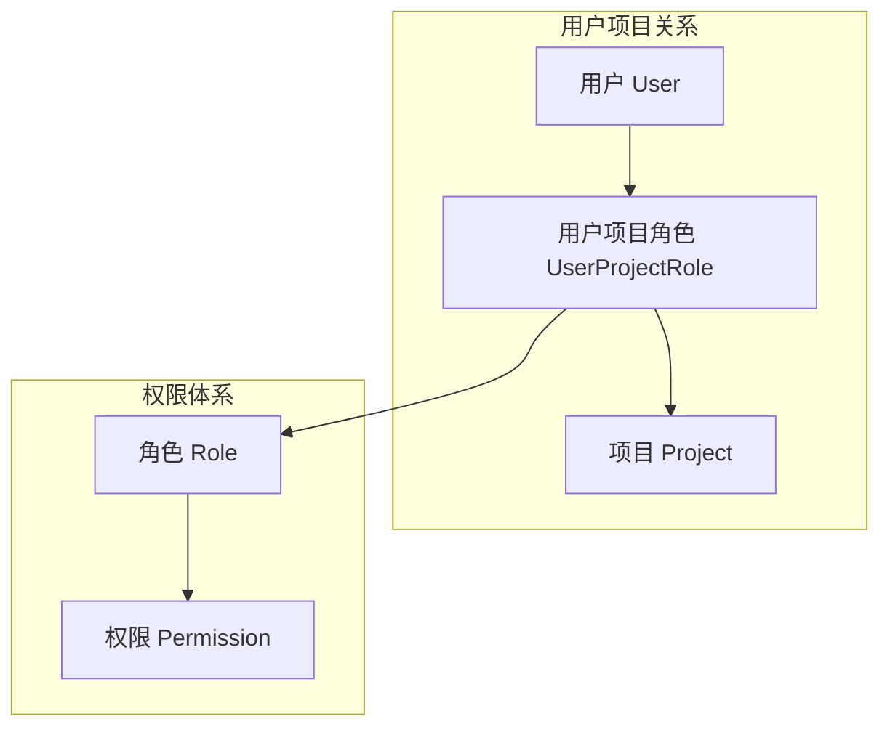

# 项目权限管理RBAC设计方案

## 1. 当前单角色RBAC局限性分析

### 1.1 现有架构问题

当前用户管理框架采用单一角色设计，存在以下核心问题：

* **权限粒度过粗**：用户只能拥有全局角色，无法针对具体项目进行细粒度权限控制

* **项目隔离缺失**：无法区分用户在不同项目中的权限，导致权限泄露风险

* **扩展性差**：新项目创建时无法灵活分配用户权限，需要重新设计权限体系

* **用户体验差**：用户无法清晰了解自己在各项目中的具体权限范围

### 1.2 业务场景痛点

* 项目经理需要为不同成员分配不同的项目权限

* 用户在不同项目中需要承担不同角色（如开发者、测试者、观察者）

* 需要支持项目级别的权限继承和权限委托

## 2. 项目范围权限设计方案

### 2.1 核心架构设计



### 2.2 数据模型设计

```mermaid
erDiagram
    USERS ||--o{ USER_PROJECT_ROLES : has
    PROJECTS ||--o{ USER_PROJECT_ROLES : contains
    ROLES ||--o{ USER_PROJECT_ROLES : assigned
    ROLES ||--o{ ROLE_PERMISSIONS : has
    PERMISSIONS ||--o{ ROLE_PERMISSIONS : assigned

    USERS {
        uuid id PK
        string email UK
        string name
        timestamp created_at
        timestamp updated_at
    }
    
    PROJECTS {
        uuid id PK
        string name
        string description
        uuid owner_id FK
        string status
        timestamp created_at
        timestamp updated_at
    }
    
    ROLES {
        uuid id PK
        string name UK
        string description
        string level
        timestamp created_at
    }
    
    PERMISSIONS {
        uuid id PK
        string resource UK
        string action UK
        string description
        timestamp created_at
    }
    
    USER_PROJECT_ROLES {
        uuid id PK
        uuid user_id FK
        uuid project_id FK
        uuid role_id FK
        timestamp assigned_at
        uuid assigned_by FK
    }
    
    ROLE_PERMISSIONS {
        uuid id PK
        uuid role_id FK
        uuid permission_id FK
        timestamp created_at
    }
}
```

### 2.3 角色层级设计

| 角色名称  | 角色级别      | 核心权限        | 适用场景   |
| ----- | --------- | ----------- | ------ |
| 项目所有者 | owner     | 项目所有权限      | 项目负责人  |
| 项目经理  | manager   | 项目管理、成员管理   | 项目管理者  |
| 开发者   | developer | 代码读写、任务管理   | 开发团队成员 |
| 测试者   | tester    | 测试用例管理、缺陷管理 | 测试团队成员 |
| 观察者   | viewer    | 只读权限        | 项目干系人  |

### 2.4 权限定义规范

权限采用 **资源:操作** 的格式定义：

```
# 项目权限
project:read          # 查看项目信息
project:update        # 修改项目信息
project:delete        # 删除项目

# 成员管理权限
member:read           # 查看项目成员
member:add            # 添加项目成员
member:remove         # 移除项目成员
member:role_update    # 修改成员角色

# 代码权限
code:read             # 读取代码
code:write            # 修改代码
code:review           # 代码审查

# 任务权限
task:read             # 查看任务
task:create           # 创建任务
task:update           # 更新任务
task:delete           # 删除任务
```

## 3. 技术实现方案

### 3.1 数据库表结构

```sql
-- 用户表（基于现有框架）
CREATE TABLE users (
    id UUID PRIMARY KEY DEFAULT gen_random_uuid(),
    email VARCHAR(255) UNIQUE NOT NULL,
    name VARCHAR(100) NOT NULL,
    created_at TIMESTAMP WITH TIME ZONE DEFAULT NOW(),
    updated_at TIMESTAMP WITH TIME ZONE DEFAULT NOW()
);

-- 项目表
CREATE TABLE projects (
    id UUID PRIMARY KEY DEFAULT gen_random_uuid(),
    name VARCHAR(255) NOT NULL,
    description TEXT,
    owner_id UUID REFERENCES users(id),
    status VARCHAR(50) DEFAULT 'active',
    created_at TIMESTAMP WITH TIME ZONE DEFAULT NOW(),
    updated_at TIMESTAMP WITH TIME ZONE DEFAULT NOW()
);

-- 角色表
CREATE TABLE roles (
    id UUID PRIMARY KEY DEFAULT gen_random_uuid(),
    name VARCHAR(100) UNIQUE NOT NULL,
    description TEXT,
    level VARCHAR(50) NOT NULL,
    created_at TIMESTAMP WITH TIME ZONE DEFAULT NOW()
);

-- 权限表
CREATE TABLE permissions (
    id UUID PRIMARY KEY DEFAULT gen_random_uuid(),
    resource VARCHAR(100) NOT NULL,
    action VARCHAR(100) NOT NULL,
    description TEXT,
    created_at TIMESTAMP WITH TIME ZONE DEFAULT NOW(),
    UNIQUE(resource, action)
);

-- 用户项目角色关联表
CREATE TABLE user_project_roles (
    id UUID PRIMARY KEY DEFAULT gen_random_uuid(),
    user_id UUID REFERENCES users(id) ON DELETE CASCADE,
    project_id UUID REFERENCES projects(id) ON DELETE CASCADE,
    role_id UUID REFERENCES roles(id) ON DELETE CASCADE,
    assigned_at TIMESTAMP WITH TIME ZONE DEFAULT NOW(),
    assigned_by UUID REFERENCES users(id),
    UNIQUE(user_id, project_id, role_id)
);

-- 角色权限关联表
CREATE TABLE role_permissions (
    id UUID PRIMARY KEY DEFAULT gen_random_uuid(),
    role_id UUID REFERENCES roles(id) ON DELETE CASCADE,
    permission_id UUID REFERENCES permissions(id) ON DELETE CASCADE,
    created_at TIMESTAMP WITH TIME ZONE DEFAULT NOW(),
    UNIQUE(role_id, permission_id)
);

-- 创建索引
CREATE INDEX idx_user_project_roles_user_id ON user_project_roles(user_id);
CREATE INDEX idx_user_project_roles_project_id ON user_project_roles(project_id);
CREATE INDEX idx_user_project_roles_role_id ON user_project_roles(role_id);
CREATE INDEX idx_role_permissions_role_id ON role_permissions(role_id);
CREATE INDEX idx_role_permissions_permission_id ON role_permissions(permission_id);

-- 权限设置
GRANT SELECT ON users TO anon;
GRANT SELECT ON projects TO anon;
GRANT ALL PRIVILEGES ON users TO authenticated;
GRANT ALL PRIVILEGES ON projects TO authenticated;
GRANT ALL PRIVILEGES ON roles TO authenticated;
GRANT ALL PRIVILEGES ON permissions TO authenticated;
GRANT ALL PRIVILEGES ON user_project_roles TO authenticated;
GRANT ALL PRIVILEGES ON role_permissions TO authenticated;
```

### 3.2 Supabase RLS策略

```sql
-- 项目表RLS策略
ALTER TABLE projects ENABLE ROW LEVEL SECURITY;

-- 用户可以查看自己参与的项目
CREATE POLICY "Users can view projects they are member of"
    ON projects FOR SELECT
    USING (
        EXISTS (
            SELECT 1 FROM user_project_roles
            WHERE user_project_roles.project_id = projects.id
            AND user_project_roles.user_id = auth.uid()
        )
    );

-- 项目所有者可以更新项目
CREATE POLICY "Project owners can update projects"
    ON projects FOR UPDATE
    USING (
        EXISTS (
            SELECT 1 FROM user_project_roles
            JOIN roles ON user_project_roles.role_id = roles.id
            WHERE user_project_roles.project_id = projects.id
            AND user_project_roles.user_id = auth.uid()
            AND roles.level = 'owner'
        )
    );

-- 用户项目角色表RLS策略
ALTER TABLE user_project_roles ENABLE ROW LEVEL SECURITY;

-- 项目管理者可以管理成员
CREATE POLICY "Project managers can manage members"
    ON user_project_roles FOR ALL
    USING (
        EXISTS (
            SELECT 1 FROM user_project_roles as upr
            JOIN roles ON upr.role_id = roles.id
            WHERE upr.project_id = user_project_roles.project_id
            AND upr.user_id = auth.uid()
            AND roles.level IN ('owner', 'manager')
        )
    );
```

### 3.3 权限检查工具函数

```typescript
// 权限检查工具类
export class PermissionChecker {
  // 检查用户在项目中是否拥有特定权限
  static async hasPermission(
    userId: string,
    projectId: string,
    resource: string,
    action: string
  ): Promise<boolean> {
    const { data, error } = await supabase
      .from('user_project_roles')
      .select(`
        roles (
          role_permissions (
            permissions (
              resource,
              action
            )
          )
        )
      `)
      .eq('user_id', userId)
      .eq('project_id', projectId);

    if (error || !data) return false;

    return data.some(upr => 
      upr.roles.role_permissions.some(rp => 
        rp.permissions.resource === resource && 
        rp.permissions.action === action
      )
    );
  }

  // 获取用户在项目中的所有权限
  static async getUserProjectPermissions(
    userId: string,
    projectId: string
  ): Promise<string[]> {
    const { data, error } = await supabase
      .from('user_project_roles')
      .select(`
        roles (
          role_permissions (
            permissions (
              resource,
              action
            )
          )
        )
      `)
      .eq('user_id', userId)
      .eq('project_id', projectId);

    if (error || !data) return [];

    const permissions = new Set<string>();
    data.forEach(upr => {
      upr.roles.role_permissions.forEach(rp => {
        permissions.add(`${rp.permissions.resource}:${rp.permissions.action}`);
      });
    });

    return Array.from(permissions);
  }

  // 获取用户在项目中的角色
  static async getUserProjectRoles(
    userId: string,
    projectId: string
  ): Promise<string[]> {
    const { data, error } = await supabase
      .from('user_project_roles')
      .select(`
        roles (
          name,
          level
        )
      `)
      .eq('user_id', userId)
      .eq('project_id', projectId);

    if (error || !data) return [];

    return data.map(upr => upr.roles.name);
  }
}
```

## 4. 前端权限控制

### 4.1 React权限钩子

```typescript
// 权限检查Hook
export function usePermission(projectId: string) {
  const user = useUser(); // 假设已有的用户Hook
  const [permissions, setPermissions] = useState<string[]>([]);
  const [loading, setLoading] = useState(true);

  useEffect(() => {
    if (user && projectId) {
      loadPermissions();
    }
  }, [user, projectId]);

  const loadPermissions = async () => {
    setLoading(true);
    const userPermissions = await PermissionChecker.getUserProjectPermissions(
      user.id,
      projectId
    );
    setPermissions(userPermissions);
    setLoading(false);
  };

  const hasPermission = (resource: string, action: string): boolean => {
    return permissions.includes(`${resource}:${action}`);
  };

  return {
    permissions,
    hasPermission,
    loading,
    refresh: loadPermissions
  };
}

// 权限控制组件
export function PermissionGuard({
  projectId,
  resource,
  action,
  children,
  fallback = null
}: {
  projectId: string;
  resource: string;
  action: string;
  children: React.ReactNode;
  fallback?: React.ReactNode;
}) {
  const { hasPermission, loading } = usePermission(projectId);

  if (loading) {
    return <div>Loading...</div>;
  }

  if (hasPermission(resource, action)) {
    return <>{children}</>;
  }

  return <>{fallback}</>;
}
```

### 4.2 使用示例

```typescript
// 在项目详情页面中使用
function ProjectDetail({ projectId }: { projectId: string }) {
  const { hasPermission } = usePermission(projectId);

  return (
    <div>
      <h1>项目详情</h1>
      
      <PermissionGuard
        projectId={projectId}
        resource="project"
        action="update"
        fallback={<Button disabled>编辑项目</Button>}
      >
        <Button onClick={handleEdit}>编辑项目</Button>
      </PermissionGuard>

      <PermissionGuard
        projectId={projectId}
        resource="member"
        action="read"
      >
        <ProjectMembers projectId={projectId} />
      </PermissionGuard>
    </div>
  );
}
```

## 5. 迁移策略

### 5.1 数据迁移

1. **备份现有数据**：确保现有用户数据安全
2. **创建新表结构**：按照设计方案创建新表
3. **迁移用户角色**：将现有全局角色转换为项目默认角色
4. **验证数据完整性**：确保迁移后数据一致性

### 5.2 代码适配

1. **更新权限检查逻辑**：替换原有全局权限检查
2. **修改API调用**：添加项目ID参数
3. **前端组件调整**：使用新的权限控制组件
4. **测试验证**：全面测试权限控制功能

### 5.3 渐进式部署

1. **并行运行**：新旧权限系统并行运行一段时间
2. **灰度发布**：先在小范围项目中测试新权限系统
3. **逐步切换**：根据测试结果逐步扩大应用范围
4. **清理旧系统**：确认新系统稳定后移除旧权限逻辑

## 6. 安全考虑

### 6.1 权限最小化原则

* 默认不给任何权限，需要显式授权

* 权限继承需要谨慎设计，避免权限扩散

* 定期审计用户权限，及时回收不必要的权限

### 6.2 审计日志

* 记录所有权限变更操作

* 记录用户权限使用情况

* 提供权限审计报告功能

### 6.3 性能优化

* 使用缓存减少权限查询次数

* 批量权限检查优化

* 数据库索引优化

## 7. 扩展能力

### 7.1 权限组支持

* 支持自定义权限组

* 权限组可以包含多个权限

* 权限组可以嵌套

### 7.2 临时权限

* 支持临时授权

* 支持权限自动过期

* 支持权限委托

### 7.3 权限继承

* 支持项目模板权限

* 支持权限继承规则

* 支持权限覆盖

