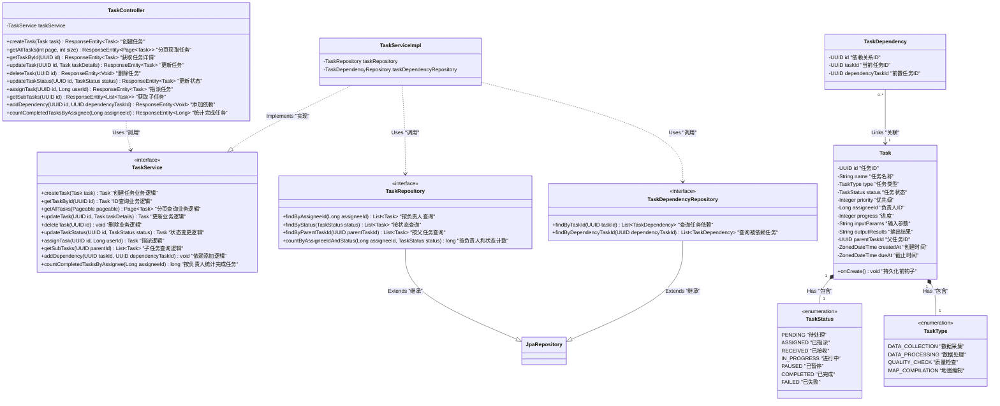

# 任务管理服务 UML 类图 (Task Management Service Class Diagram)

本文档展示了任务管理服务的核心类结构及其关系。

## 说明 (Notes)

1.  **分层架构 (Layered Architecture)**:
    *   **Controller**: 处理 HTTP 请求，调用 Service 层。
    *   **Service**: 包含核心业务逻辑（如状态流转、依赖检查）。
    *   **Repository**: 负责与数据库交互。

2.  **核心实体 (Core Entities)**:
    *   **Task**: 核心业务对象，包含状态、类型、进度等信息。
    *   **TaskDependency**: 专门用于管理任务间的 DAG 依赖关系。

3.  **枚举 (Enums)**:
    *   **TaskStatus**: 定义了严格的任务生命周期状态。
    *   **TaskType**: 区分不同的生产任务类型。
